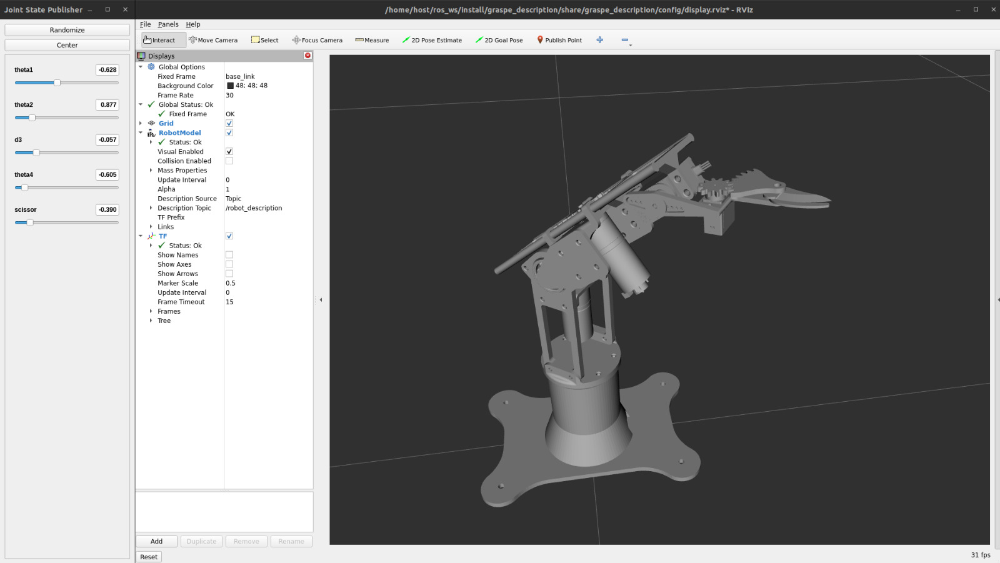
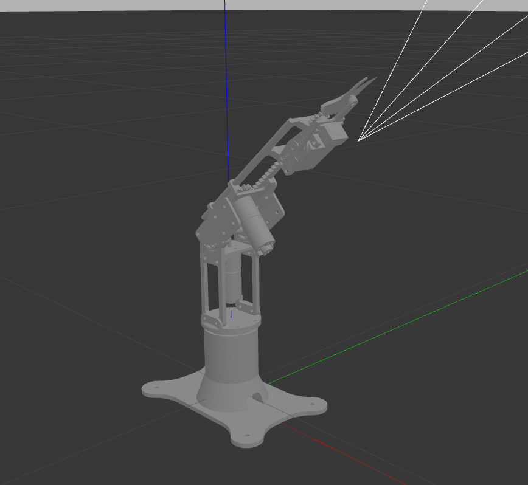
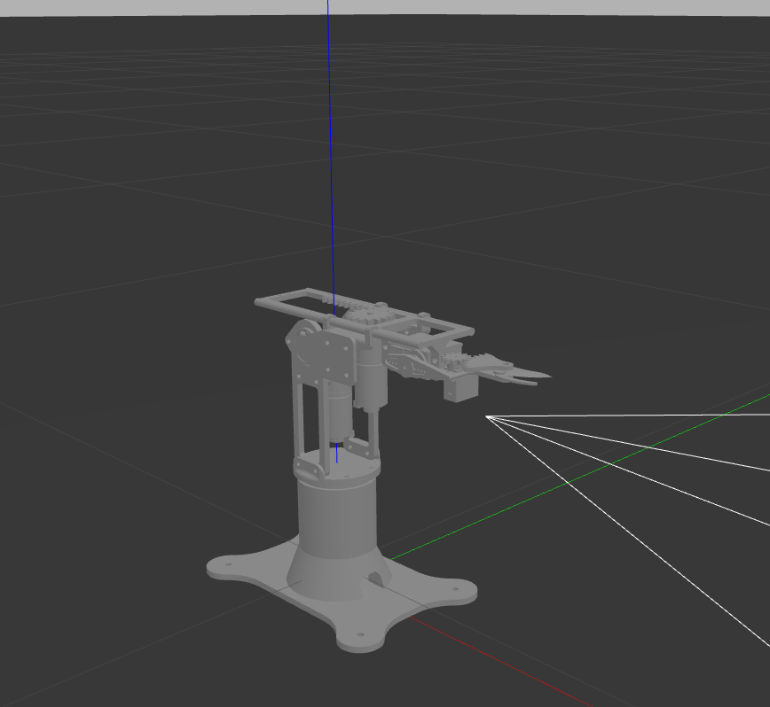

<p align="center">
  
</p>

# Introduction

This project was developed as part of an academic assignment during our undergraduate studies. The objective of the assignment was to design a robotic manipulator to solve a problem freely chosen by the students, applying the concepts learned throughout the course.

The Grasp-e project consists of a robotic manipulator designed to implement the thinning and harvesting technique in grapevines, with a special focus on table grapes. See more about the project on the [wiki](https://github.com/JPBG-USP/graspe/wiki/1.-Grasp%E2%80%90e-Project)

# Get Started

This project is built on containers, so it is necessary to have Docker installed. You can follow the steps to install Docker [here](https://docs.docker.com/get-started/get-docker/).

To simplify the use and execution of the Docker container, scripts have been created for **build** and **run** operations. They can be found in the `docker/scripts` folder.

First, in the graspe folder, you need to build the Docker image by running the following command:

```bash
bash docker/scripts/build.sh
```
If everything goes well, you should receive: ```[xx:xx:xx][INFO] Docker image built successfully.```.

To start the container, simply run the command:

```bash
bash docker/scripts/run.sh
```

>If this is not your first time starting the container, you will receive a message indicating that a container already exists, along with an option to delete the existing container and open a new one. If you are just getting started, feel free to open a new container. However, if you are developing a project using Grasp-e, we recommend reviewing the documentation available at the project [wiki](https://github.com/JPBG-USP/graspe/wiki/4.-Docker).

It is important in some stepts to have more than one terminal opened inside the container. For this, we prepared a script that can open this new terminal automatically, you can also execute other commands inside the container. Note that, just like all our scripts commands, this should be run in the graspe directory. You just need to execute this command in a new terminal.

```bash
bash docker/scripts/exec.sh
```
## Visualization and Simulation

### Preparing the ROS Workspace

Inside the container, the terminal will start in the `ros_ws` directory. First, you need to build the ROS workspace by running the following command:

```bash
colcon build
```

After building, source the workspace setup file to load the environment:

```bash
source install/setup.bash
```

### Rviz

Now inside the container you have the ROS2 Humble environment, with the workspace and the graspe packages. To open the Rviz visualization, you can run this command inside the container.

```bash
ros2 launch graspe_description general.launch.py 
```

You should be able to see the Rviz representation of the robot, along with a window with sliders that let you control the position of the end effector by adjusting the state of each joint. An example of this procedure is shown below.

<p align="center">
  
</p>

### Gazebo

The general launch file has the option to run the Gazebo simulation instead, which is done by passing the `gazebo:=true` tag on the launch command, as follows.

```bash
ros2 launch graspe_description general.launch.py gazebo:=true
```

At this point, you should have another terminal opened inside the container, which can be done using the `exec.sh` script. 

The next step is to publish a trajectory message on the correct topic. It works as a rudimentary forward kinematics implementation, since we pass the desired states of each joint in the message. The command is as follows, and for different poses, alter the `"positions"` vector.

```bash
ros2 topic pub /trajectory_position_controller/joint_trajectory trajectory_msgs/msg/JointTrajectory '{
  "header": {
    "stamp": {"sec": 0, "nanosec": 0},
    "frame_id": ""
  },
  "joint_names": ["theta1", "theta2", "d3", "theta4", "scissor"],
  "points": [
    {
      "positions": [-1.0, 1.5707, -0.07, 0.0, 0.0],
      "velocities": [],
      "accelerations": [],
      "effort": [],
      "time_from_start": {"sec": 3, "nanosec": 0}
    }
  ]
}'
```
Below is a comparison of the state of the robot before and after the command.
<p align="center">
  
   
</p>

You can also see the tutoral video in portuguese for running the commands

[](https://drive.google.com/file/d/16iZdYxlaE_CvwlOo4rdcEHDZO_hONprg/view?usp=sharing)

Now you are ready to use the graspe project, you can see more about the project and its ros packages and docker in the project [wiki](https://github.com/JPBG-USP/graspe/wiki).

# Team Grasp-e
| Photo | Name | Contribution | GitHub | LinkedIn | Email |
|-------|------|--------------|--------|----------|-------|
|  | João Pedro Baltieca Garcia | Code development, documentation, and modeling of the manipulator. | [GitHub](https://github.com/JPBG-USP) | [LinkedIn](https://www.linkedin.com/in/jo%C3%A3o-pedro-baltieca-garcia-573b15242/) | joao_garciajp@usp.br |
|  | João Assuéro Rêgo de Alencar | Code development, documentation, modeling of the manipulator and artwork. | [GitHub](https://github.com/JoaoAlencar21) | [LinkedIn](https://br.linkedin.com/in/jo%C3%A3o-assu%C3%A9ro-r%C3%AAgo-de-alencar-b386692b3?original_referer=https%3A%2F%2Fwww.google.com%2F) | joaoassuero@usp.br |
|  | Mateus Alonso | CAD modeling, business system development and modeling of the manipulator. | [GitHub](https://github.com/MateusAlo) | [LinkedIn](https://www.linkedin.com/in/mateus-alonso-2ab3b0232/) | mateusalonso@usp.br |
|  | Tailan | Business system development and modeling of the manipulator. | [GitHub]() | [LinkedIn]() | naliat.av@usp.br |
|  | Vitor Garcia Ribeiro | CAD modeling, URDF modelling and business system development . | [GitHub](https://github.com/VitorGaRi) | [LinkedIn](https://www.linkedin.com/in/vitor-ribeiro-a8851b258/) | v.ribeiro@usp.br |
|  | Gustavo Paredes Moura | CAD modeling and business system development . | [GitHub]() | [LinkedIn](https://www.linkedin.com/in/gustavo-paredes-moura-5696a3240/) | gupmourausp@usp.br |

> All members are students of Mechatronic Engineering at the University of São Paulo, School of Engineering in São Carlos.
